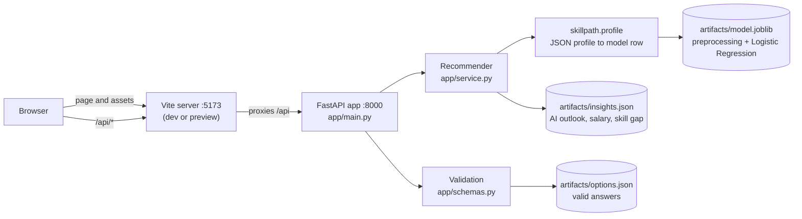
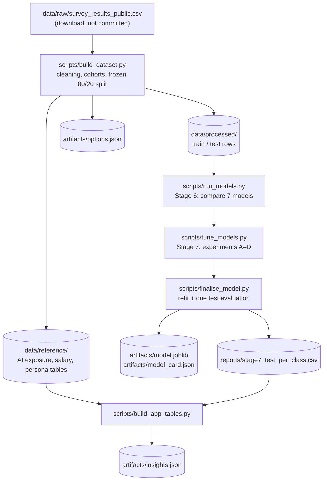

# SkillPath

> Developer job-role and career-path recommendations, learned from the Stack Overflow Annual Developer Survey 2025.


## Overview

SkillPath suggests developer job roles that fit a person's skills and how they use AI. A user
answers a short questionnaire covering their background, the technologies they use and want to learn, and their AI usage. SkillPath then
compares that profile with about 18,000 survey respondents and returns:

- the **three closest job roles** out of 20 (for example Data Engineer, DevOps Engineer, AI / ML Engineer), each with a match probability;
- the **top career families** out of 12, such as Data Sci/ML or DevOps/Cloud;
- for each suggested role:
  - its **AI outlook**: how much of the role's work is already done with AI, and how many people in it see AI as a threat;
  - a **salary benchmark** from the closest peer group with enough data;
  - a **skill gap**: the technologies that set the role apart and that the user hasn't used yet.

The user can then ask **"what if…?"**: add a suggested skill or change an answer, and see how the ranking moves.

It is aimed at students, graduates and career switchers who want a data-based starting point
for choosing a direction. It gives guidance only: it is not for hiring, screening or salary decisions (see
[`artifacts/model_card.json`](artifacts/model_card.json)).

**How it works, technically.** A scikit-learn pipeline (shared preprocessing plus multinomial Logistic Regression) predicts all
20 job roles. Family probabilities are the sums of their roles' probabilities, so one model serves both levels.
A FastAPI service loads the saved pipeline and serves predictions with precomputed insight tables.
A React + TypeScript single-page app provides the questionnaire and the results. The whole
data-mining workflow is in the repository and can be reproduced: cleaning, EDA, preprocessing, model comparison, tuning
and a single held-out evaluation.

> [!NOTE]
> "AI-aware" refers to the data, not to a generative-AI service. AI usage and attitudes are
> model inputs, and the AI outlook is computed from survey answers. SkillPath calls no external AI
> API and needs no API keys.

## Project status

**Coursework project. A complete, working prototype that runs locally.** It was built for IT3051
Fundamentals of Data Mining (SLIIT).

| Area | State |
|---|---|
| Data understanding, EDA, preprocessing | Complete |
| Modelling, optimisation, held-out evaluation | Complete. Final model saved in `artifacts/` |
| Web API (FastAPI) | Complete |
| Web app (React) | Complete, including a responsive, accessible interface with glass styling and Motion animation |
| Automated tests | 203 tests: Python, frontend unit and browser |
| Deployment | **Not set up.** No Dockerfile, CI or hosting configuration; runs on a developer machine |
| Authentication | None. The app has no user accounts and stores nothing |

### Model performance

On the 4,615 held-out respondents, which the model never saw during training or selection:

| Metric | Value |
|---|---:|
| Correct job role among the **3 shown** | **83.9%** |
| Correct career family among the top 3 | **87.8%** |
| Top-1 accuracy (20 roles) | 54.9% |
| Macro-F1 (20 roles) | 0.285 |

Macro-F1 was used to *select* the model, because it penalises ignoring rare roles. The
user-facing figure is top-3 accuracy, because the app always shows three roles and their families, never a
single answer.

## Key features

### Questionnaire

- **Three optional steps:**
  - *About you:* country, education, years coding, years of work.
  - *Technologies:* 7 areas, each with "used", "want to learn" and "I don't use any".
  - *AI usage:* 5 questions.

  A skipped question counts as "unknown", as it did in the survey.
- **Answer options come from the API** (`GET /api/options`), so the form only offers values the model was trained on.
- **Two layers of validation:**
  - The browser checks the same rules as the API.
  - Any error the API returns is shown on the field it names, and the form jumps to that step.
- **Four example profiles** fill the whole form in one click (`frontend/src/samples.ts`). **Clear answers** can be undone.

### Recommendations

- **Top 3 job roles,** each with:
  - a match percentage and a short description;
  - a **low-confidence** badge on the 7 roles the model rarely identifies correctly.
- **Top career families,** and a ranking of all 20 roles.
- **Caveats returned by the API,** for example when salary figures fall back to worldwide data.

### Career insights (per role)

- **AI outlook:**
  - the AI Exposure Index today and expected (0–100);
  - the share of people who see AI as a threat to their job;
  - each figure next to the all-roles average.
- **Salary benchmark:**
  - median and interquartile range in USD per year;
  - taken from the most specific peer group with at least 30 people: role or family, combined with country, region or worldwide, always within the user's experience band.
- **Skill gap:** up to five distinctive technologies of the role that the user hasn't used yet, and the ones they already use.

### What-if simulation

- Press **What if I add …?** on the recommended next step, **What if?** next to any suggested skill, or change any answer.
  The app re-runs the prediction and shows before and after side by side: role rank changes, probability changes and
  the list of edits.
- **Your explorations** lists every run of the session (kept in memory only, never saved), with what changed and the
  best match it produced; any earlier run can be brought back.

### Interface

- **Results dashboard:** a spotlight on the best match (match ring, skill readiness, recommended next step), the three
  roles side by side (choosing one focuses the detailed insights on it), the career landscape and how the result was reached.
- **Design system** (`frontend/src/design/`): layered glass materials over a static aurora backdrop, colour tones per
  kind of insight, and shared tiles, pills, meters and rings.
- **Scrolling:** eased wheel and trackpad scrolling (Lenis; touch and keyboard stay native), sections and tiles that reveal as they
  scroll into view, a hero that hands over to the questionnaire, light parallax depth behind the glass, a nav whose glass
  firms up as the page scrolls, and a section rail on wide screens. All of it is off with reduced motion; phones keep reveals only.
- **Light and dark themes.** The theme follows the system setting, and the nav button overrides it.
- **Print / Save as PDF** prints only the results, in light colours, without buttons.
- **Responsive** from 320 px phones to wide desktops.
- **Accessibility:**
  - keyboard operation and focus management;
  - screen-reader announcements and AA contrast;
  - reduced motion and reduced transparency;
  - Windows contrast themes.
- **Resilience:**
  - a slow request shows an "analysing" state;
  - an unreachable API shows a message saying how to start it;
  - unexpected responses and crashes show an error screen instead of a blank page.

## Architecture

SkillPath has two halves:

- an **offline pipeline** that turns the raw survey into a trained model and lookup tables;
- an **online application** that serves predictions from those saved files.

The online application needs no database and no access to the respondent-level data.

### Runtime



1. The browser loads the React app from Vite. Calls to `/api` go to the same origin, and Vite forwards them
   to uvicorn, so the backend needs no CORS configuration.
2. `app/schemas.py` (Pydantic) checks every answer against `artifacts/options.json`, using the same rules that
   cleaned the training data. Invalid input returns a 422 with one readable message per field.
3. `app/service.py` turns the profile into a survey-format row with `skillpath.profile.profile_to_frame()`.
   It runs the row through the saved pipeline, then adds AI outlook, salary and skill-gap figures from `insights.json`.
4. The model is loaded once at startup. Nothing the user sends is stored or logged.

**No preprocessing is reimplemented in the API.** The saved pipeline contains the fitted preprocessing, so
serving uses exactly the transformations used in training. `scripts/finalise_model.py` checks this
by comparing 300 rows sent through the API code path with direct model calls: the probabilities are identical.

### Offline pipeline



All outputs of this pipeline are committed, so the app and tests run from a clean clone without the raw survey.

## Technology stack

| Layer | Technologies |
|---|---|
| **Data mining / ML** | Python, pandas, NumPy, scikit-learn 1.8.0 (pinned), PyArrow (Parquet), joblib, SciPy |
| **Analysis and reporting** | Jupyter + Jupytext (notebooks kept as `.py`), matplotlib, seaborn, nbconvert, ReportLab (PDF report), XlsxWriter |
| **Backend** | FastAPI, Pydantic v2, Uvicorn |
| **Frontend** | React 19, TypeScript 6, Vite 8, Material UI 9 (Emotion), Motion for React 14, Lenis (smooth wheel scrolling), Inter variable font (Fontsource; used where SF Pro is not available) |
| **Testing** | pytest (with FastAPI `TestClient`), Vitest, Puppeteer (`puppeteer-core`) driving Chrome |
| **Code quality** | TypeScript compiler (`tsc -b`), oxlint |
| **Storage** | Files only: Parquet, CSV, JSON and joblib. No database |

## Project structure

```text
skillpath/
├── app/                      FastAPI web API
│   ├── main.py               app, lifespan model loading, 3 endpoints, readable 422 errors
│   ├── schemas.py            request validation against options.json, response models
│   └── service.py            profile → model → top-3 roles + insights + caveats
├── src/skillpath/            Python package shared by scripts, notebooks, tests and the API
│   ├── config.py             every threshold, mapping and column list in one place
│   ├── data.py               survey loading, country → region lookup
│   ├── cleaning.py           deterministic row cleaning and salary outlier rules
│   ├── cohorts.py            recommender, salary and persona cohorts; AI Exposure Index
│   ├── split.py              stratified 80/20 split, frozen by ResponseId
│   ├── features.py           custom scikit-learn transformers (e.g. TechBlockEncoder)
│   ├── pipeline.py           build_preprocessor(): the shared preprocessing pipeline
│   ├── targets.py            job role → family probabilities, top-k helpers
│   ├── modelling.py          candidate models, metrics, resampling, CV experiment runner
│   ├── profile.py            API contract: JSON profile ↔ survey-format row; options.json
│   ├── insights.py           AI outlook, salary benchmark and skill-gap tables and lookups
│   ├── viz.py                chart style for notebooks and reports
│   └── resources/            country_region.csv
├── frontend/                 React web app (see "Frontend layout" below)
├── scripts/                  pipeline, modelling and reporting scripts (see "Scripts")
├── notebooks/                01 data understanding · 02 EDA · 03 preprocessing ·
│                             04 modelling and optimisation · 06 Evaluation 2 walkthrough
│                             (.py is the source, .ipynb holds executed outputs)
├── data/
│   ├── raw/                  place the survey CSVs here (git-ignored, ~140 MB)
│   ├── processed/            train/test rows, split IDs, transformed feature matrices
│   └── reference/            AI exposure, persona and salary reference tables
├── artifacts/                everything the API loads
│   ├── model.joblib          final fitted pipeline (preprocessing + classifier)
│   ├── model_card.json       intended use, limitations, scores, scikit-learn version
│   ├── options.json          every valid answer, used by the API and the form
│   ├── insights.json         group-level summaries for the career insights
│   └── preprocessor_core.joblib, feature_names_core.json, salary_outlier_rule.json
├── reports/                  decisions, results, figures, HTML notebooks, technical report
├── tests/                    pytest suites (data, modelling, insights, API)
├── pyproject.toml            package metadata and pytest configuration
└── requirements.txt          pinned environment for the whole project
```

<details>
<summary><strong>Frontend layout</strong></summary>

```text
frontend/
├── src/
│   ├── App.tsx               app state, requests, navigation, what-if, session history, toasts
│   ├── api/                  types mirroring app/schemas.py; fetch client with response checks
│   ├── design/               design tokens (colour, glass materials, elevation, type) and shared primitives
│   ├── components/           nav, hero, profile workspace and steps, choice cards, …
│   │   └── dashboard/        results: spotlight, role switcher, insights, landscape, what-if, explorations
│   ├── form.ts               form state ↔ API profile, client-side validation
│   ├── whatif.ts             before/after comparison of two results
│   ├── explorations.ts       the session's runs (memory only)
│   ├── questions.ts          question wording from the 2025 questionnaire
│   ├── samples.ts            the four example profiles
│   ├── theme.ts              MUI theme built from the design tokens, light and dark
│   ├── motion.ts             shared easing/duration tokens, reveal variants and scroll-aware hooks
│   ├── scroll.ts             smooth scrolling (Lenis) and programmatic scrolling
│   ├── index.css             entrance keyframes, reduced-motion, contrast-theme and print rules
│   └── *.test.ts             Vitest unit tests
├── e2e/run.mjs               browser test (15 cases) in Chrome via Puppeteer
├── vite.config.ts            dev/preview server, /api proxy, Vitest config
└── package.json              npm scripts
```

</details>

<details>
<summary><strong>Reports</strong></summary>

| File | Contents |
|---|---|
| `reports/preprocessing_decisions.md` | Stages 3–4: every cleaning and preprocessing decision with evidence |
| `reports/modelling_decisions.md` | Stages 6–7: experiments, results and the reasoning behind the final model |
| `reports/testing.md` | Stage 11: test strategy, test cases, results and defects found |
| `reports/SkillPath_Stage6-8_Report.pdf` | Technical report, generated from the result files |
| `reports/model_experiments.csv` | Every cross-validation run, timestamped and appended to by each script |
| `reports/stage6_*`, `reports/stage7_*` | Model comparison, per-class results, search results, final selection, test results |
| `reports/feature_dictionary.csv` | All 479 model features with their source and transformation |
| `reports/figures/`, `reports/html/` | Report figures and the notebooks as HTML |

</details>

## Prerequisites

| Requirement | Version | Needed for |
|---|---|---|
| Python | **3.11 or newer** (developed on 3.13) | API, package, tests, notebooks. The pinned scikit-learn 1.8.0 needs Python 3.11 or newer |
| Node.js and npm | **22.12 or newer** (developed on Node 24) | Web app. Vitest 5 and oxlint need Node 22.12 or newer |
| Git | any | Cloning |
| Google Chrome or Chromium | any recent | Only for the browser test (`npm run e2e`) |
| Stack Overflow 2025 survey CSV | — | Only to rebuild the dataset from scratch; the processed data is committed |

No database, Docker, cloud account or API key is required.

## Installation

### 1. Clone

```bash
git clone https://github.com/PasinduSuraweera/skillpath.git
cd skillpath
```

### 2. Backend and Python package

```bash
python3 -m venv .venv
source .venv/bin/activate          # Windows: .venv\Scripts\activate
pip install -r requirements.txt
pip install -e .                   # installs the skillpath package in editable mode
```

> [!IMPORTANT]
> Install the package with `-e` (editable). `skillpath.config` finds `data/`, `artifacts/` and
> `reports/` relative to the source folder, so a non-editable install cannot find them.

### 3. Frontend

```bash
cd frontend
npm install
cd ..
```

### 4. Check the setup

```bash
pytest -q                          # expect: 106 passed, 1 skipped
```

The skipped test (`test_every_survey_country_maps_to_a_region`) needs the raw survey file and runs once it is in `data/raw/`.

### 5. Optional: raw survey data

Only needed to rebuild the processed data or re-run the notebooks. Download the 2025 survey from
<https://survey.stackoverflow.co/2025/>, then place `survey_results_public.csv` and
`survey_results_schema.csv` in `data/raw/` (see [`data/raw/README.md`](data/raw/README.md)).

## Configuration

SkillPath has no `.env` file and needs no secrets. Model and data settings (thresholds, mappings,
peer-group rules) are constants in [`src/skillpath/config.py`](src/skillpath/config.py), each with a note explaining its value.

The few runtime settings are environment variables used by the frontend tooling:

| Variable | Used by | Default | Purpose |
|---|---|---|---|
| `SKILLPATH_API` | `vite.config.ts` (dev and preview) | `http://127.0.0.1:8000` | Where Vite forwards `/api` requests |
| `E2E_APP` | `e2e/run.mjs` | `http://localhost:5173/` | Address of the running web app under test |
| `CHROME_PATH` | `e2e/run.mjs` | usual install paths on macOS, Windows, Linux | Chrome or Chromium binary |
| `E2E_SHOTS` | `e2e/run.mjs` | `frontend/e2e/shots/` (git-ignored) | Where screenshots are saved |
| `E2E_HEADFUL` | `e2e/run.mjs` | unset (headless) | Set to `1` to watch the browser |

## Running the application

Run the API and the web app in two terminals, both from the repository root.

```bash
# Terminal 1: API on http://127.0.0.1:8000 (interactive docs at /docs)
source .venv/bin/activate
uvicorn app.main:app --reload
```

```bash
# Terminal 2: web app on http://localhost:5173
cd frontend
npm run dev
```

Open <http://localhost:5173>. To use another API port, start uvicorn with `--port 8001` and run
`SKILLPATH_API=http://127.0.0.1:8001 npm run dev`.

### Production build

```bash
cd frontend
npm run build      # type-checks (tsc -b) and builds to frontend/dist/
npm run preview    # serves dist/ on port 5173 with the same /api proxy
```

`npm run preview` is for checking a build locally. For serving it properly, see [Deployment](#deployment).

### npm scripts

| Command (in `frontend/`) | What it does |
|---|---|
| `npm run dev` | Development server with hot reload and `/api` proxy |
| `npm run build` | Type-check and production build to `dist/` |
| `npm run preview` | Serve the production build locally |
| `npm run lint` | oxlint |
| `npm test` | Vitest unit tests |
| `npm run e2e` | Browser test (needs both servers running) |

## API

Base URL: `http://127.0.0.1:8000` when running uvicorn directly, or `/api` through the Vite server. There is no authentication.
FastAPI generates interactive OpenAPI docs at **`/docs`**, and the schema at `/openapi.json`.

| Method | Endpoint | Purpose |
|---|---|---|
| `GET` | `/api/health` | Service is up and the model is loaded: `{"status": "ok", "version": "0.1.0", "model": "Logistic Regression"}` |
| `GET` | `/api/options` | Every valid answer: 176 countries, education levels, AI answers, the technologies in each of the 7 areas, year limits, data attribution |
| `POST` | `/api/predict` | Profile in → recommendations out |

### `POST /api/predict`

Every field is optional. A missing field means "unknown", and `"none": true` means "I don't use any technology in this area".

```bash
curl -s http://127.0.0.1:8000/api/predict \
  -H 'Content-Type: application/json' \
  -d '{
        "country": "Sri Lanka", "years_code": 5, "work_exp": 1,
        "tech": {"Language": {"have": ["Python", "SQL"], "want": ["Rust"]},
                 "Webframe": {"none": true}},
        "ai": {"AISelect": "Yes, I use AI tools daily"}
      }'
```

Response (abridged):

```jsonc
{
  "roles": [                        // top 3 job roles
    {
      "rank": 1, "job_role": "AI/ML engineer", "label": "AI / ML Engineer",
      "family": "Data Sci/ML", "probability": 0.26, "low_confidence": false,
      "description": "…",
      "ai_outlook": { "exposure_now": …, "exposure_expected": …, "threat_yes_pct": …, "all_roles": { … } },
      "salary": { "available": true, "median": 37800, "p25": 15900, "p75": 69900,
                  "currency": "USD per year", "local": false,
                  "peer_group": "AI / ML Engineers worldwide with 0-2 years of professional experience" },
      "skill_gap": { "missing": [ { "technology": "Jupyter Notebook/JupyterLab", "share_pct": 53.0, "lift": 5.2 }, … ] }
    }
  ],
  "families": [ { "family": "Data Sci/ML", "probability": 0.34 }, … ],   // top 3 families
  "ranking":  [ … ],                // all 20 roles, most likely first (used by what-if)
  "notes":    [ "…" ],              // caveats to show with the result
  "profile":  { "region": …, "experience_band": "0-2", "tech_areas_answered": [ … ] },
  "model":    { "name": "Logistic Regression", "test_top3_accuracy": 0.8392, … },
  "attribution": "Data: Stack Overflow Annual Developer Survey 2025, licensed under the Open Database License (ODbL) v1.0. …"
}
```

**Validation rules** (in `app/schemas.py`):

- Values must appear in `GET /api/options`.
- Years must be 0–60.
- Ticking 90% or more of a technology list is rejected, as such answers were in training.
- "I don't use any" can't be combined with selected technologies.
- If `years_code` is given and `work_exp` is blank, `work_exp` counts as 0 (the survey's own instruction).

Errors return HTTP 422 with one message per field:

```json
{
  "error": "invalid_input",
  "message": "Some answers are not valid. Please correct the fields listed.",
  "fields": [
    { "field": "country", "message": "'Atlantis' is not a valid country. Valid values are listed by GET /api/options." },
    { "field": "years_code", "message": "Input should be less than or equal to 60" }
  ]
}
```

## Data

SkillPath has **no database**. All data is stored as files in the repository:

| Location | Format | Contents | Committed |
|---|---|---|---|
| `data/raw/` | CSV | Stack Overflow 2025 survey (49,123 responses × 170 columns) | No (download) |
| `data/processed/` | Parquet, CSV | Recommender cohort, train (18,457) / test (4,615) rows, frozen split IDs, feature matrices | Yes |
| `data/reference/` | Parquet | AI exposure, persona and salary reference tables | Yes |
| `artifacts/` | joblib, JSON | Fitted model, options, insight tables, model card | Yes |

**Main data domains:**

- **Respondents:** the cleaned survey rows.
- **Job roles (20) and role families (12):** the `ROLE_FAMILY` mapping in `config.py`.
- **Technologies in 7 areas:** languages, databases, platforms, web frameworks, dev environments, AI models and Stack Overflow tags.
- **AI usage and attitudes.**
- **Salaries:** converted to USD per year, after a two-stage outlier rule.

**Rebuilding.** There are no migrations or seed steps. To regenerate everything from the raw survey:

```bash
python scripts/build_dataset.py        # ~15 s; processed data, reference tables, options.json
python scripts/build_app_tables.py     # ~1 s;  artifacts/insights.json
```

Use `python scripts/show_data.py` to list or preview the Parquet files, or export them to CSV in `data/exports/` (git-ignored).

## Machine learning

### Problem

**20-class classification of a developer's job role** (the survey's `DevType`), restricted to 20 skill-defined roles.
Each role belongs to one of 12 career families. A family's probability is the sum of its roles' probabilities
(`skillpath.targets`), so one model ranks both roles and families.

### Data preparation

Full rationale: [`reports/preprocessing_decisions.md`](reports/preprocessing_decisions.md).

- **Cleaning:**
  - 49,123 raw responses become 43,242 usable ones.
  - Removed: 5,794 near-empty responses and 87 "straight-lined" ones that ticked 90% or more of a technology list.
  - Impossible experience values are fixed.
- **Recommender cohort:**
  - 23,072 respondents.
  - Split 80/20, stratified on job role and frozen by `ResponseId`.
- **Features:** the core set has 479 features:
  - technology "have" and "want" indicators, with rare options pooled into "Other";
  - years coding and years of work;
  - education and AI-usage answers as ordinal features;
  - region and AI learning as nominal features.
- **Unknown or "none":** a technology area left empty is "unknown". It is a true zero only when the respondent said they don't use that area at all.
- **No leakage:** all preprocessing lives in `skillpath.pipeline.build_preprocessor()`, inside the model pipeline, so
  every cross-validation fold refits it on its own training part.

### Model selection

5-fold stratified cross-validation on the training split. Only the final model was evaluated on the test split.

| Model | Baseline macro-F1 | Tuned macro-F1 | Test macro-F1 |
|---|---:|---:|---:|
| **Logistic Regression** | 0.2547 | **0.3030** | **0.2845** |
| Hist Gradient Boosting | 0.2724 | 0.2860 | — |
| Random Forest | 0.2537 | 0.2820 | — |
| Linear SVM (calibrated) | 0.1911 | 0.2536 | — |
| Complement Naive Bayes | 0.1786 | not tuned | — |
| k-Nearest Neighbours | 0.1676 | not tuned | — |
| Dummy (most frequent) | 0.0283 | — | — |

**Final model:** Logistic Regression with `C ≈ 0.218` and **no class weighting**, saved as `artifacts/model.joblib` (about 108 KB).

Findings to know before changing the model:

1. **`class_weight="balanced"` hurts Logistic Regression here.** Removing it gained 0.047 macro-F1, more than any
   hyperparameter. It *helps* Random Forest.
2. **Tuning changed the winner.** Gradient boosting led before tuning, Logistic Regression after.
3. **The main source of error is class imbalance.** Full-stack is 39% of the training data, and UX/UI has 47 examples. Seven roles with test
   recall below 0.10 are marked low confidence in the API and the app rather than hidden.

Details: [`reports/modelling_decisions.md`](reports/modelling_decisions.md) and the
[technical report](reports/SkillPath_Stage6-8_Report.pdf).

### Career insights

`scripts/build_app_tables.py` precomputes group summaries into `artifacts/insights.json`, excluding test respondents. The API only reads that file:

- **AI Exposure Index (0–100):**
  - computed per respondent from 13 development tasks rated "mostly AI", "partially AI" or "no AI", now and planned;
  - averaged per role (or per family when a role has too few respondents).
- **Salary:**
  - quartiles for peer groups of at least 30 people, tried from most to least specific (`config.PEER_GROUP_LEVELS`);
  - always within the user's experience band.
- **Skill gap:**
  - the role's distinctive technologies: used by at least 20% of the role (10 or more people), and at least 1.1 times as often as across all roles;
  - ranked by share × log₂(lift);
  - AI models and Stack Overflow tags are excluded.

### Reproducing the modelling

```bash
python scripts/run_models.py          # Stage 6: 7 candidates, 5-fold CV       (~29 min; --fast skips boosting)
python scripts/tune_models.py         # Stage 7: experiment phases A–D         (~41 min; --only A B for single phases)
python scripts/finalise_model.py      # refit the chosen model, evaluate on the test split once (~12 s)
python scripts/build_app_tables.py    # refresh insights.json from the new per-class results
python scripts/build_report_pdf.py    # regenerate the technical report from the result files
bash scripts/run_notebooks.sh         # execute the notebooks and refresh reports/html/
```

> [!WARNING]
> `finalise_model.py` is the only code that opens `data/processed/test.parquet`. Running it repeatedly while
> changing the model turns the test split into a second validation set. Compare models with
> cross-validation on the training split instead.

### Adding a candidate model

`skillpath.modelling` already handles the preprocessing, the validation strategy and the metrics:

```python
from sklearn.ensemble import ExtraTreesClassifier
from skillpath import modelling as M

X, y = M.load_train()                       # training split only
pipe = M.make_pipeline(ExtraTreesClassifier(n_estimators=400, random_state=42))
row = M.run_cv("Extra Trees", pipe, X, y)   # 5-fold CV, all metrics
M.append_results([row])                     # appends to reports/model_experiments.csv
```

Keep the preprocessing, and anything that resamples or selects features, *inside* the estimator (`M.OversampledClassifier`,
`M.select_kbest_pipeline`). A deployable candidate must support `predict_proba`, because the app ranks roles and sums families.

## Testing

| Suite | Location | Command | Tests |
|---|---|---|---:|
| Preprocessing (unit) | `tests/test_preprocessing.py` | `pytest -q` | 17 |
| Modelling (unit) | `tests/test_modelling.py` | `pytest -q` | 19 |
| Insights (unit) | `tests/test_insights.py` | `pytest -q` | 30 |
| Web API (integration, over HTTP) | `tests/test_api.py` | `pytest -q` | 41 |
| Web app (unit) | `frontend/src/**/*.test.ts` | `cd frontend && npm test` | 81 |
| Whole app in Chrome (system) | `frontend/e2e/run.mjs` | `cd frontend && npm run e2e` | 15 |

**What the suites cover:**

- **Python:**
  - leakage and split integrity;
  - training/serving parity: real training rows sent through HTTP give the model's own probabilities;
  - family aggregation, resampling and selection;
  - insight lookups, validation errors and response shapes.
- **Frontend unit:**
  - form ↔ API conversion and client validation;
  - API error handling and the what-if comparison;
  - formatting and animation timing tokens.
- **Browser test:**
  - the full questionnaire, examples, results and what-if;
  - validation on both sides, dark mode and print;
  - the API-down screen and the phone layout.

  It saves a screenshot of every screen.

Notes:

- `npm run e2e` needs both servers running (`uvicorn app.main:app` and `npm run dev`) and Chrome. It exits with
  code 2 if Chrome cannot be found, so set `CHROME_PATH`.
- `test_committed_insights_json_is_up_to_date` fails when code that feeds `insights.json` changed without rebuilding
  it. Run `python scripts/build_app_tables.py` and restart uvicorn.
- Test cases and earlier results are described in [`reports/testing.md`](reports/testing.md).

## Code quality

```bash
cd frontend
npx tsc -b         # type-check (also run by npm run build)
npm run lint       # oxlint (.oxlintrc.json)
```

No Python linter or formatter is configured, and there are no pre-commit hooks or CI. Run the checks above and the
test suites before opening a pull request.

## Deployment

There is **no deployment configuration** in this repository: no Dockerfile, Compose file, CI pipeline or hosting setup.
The supported way to run SkillPath is locally, as described above.

If you deploy it, note how the pieces fit together:

- The frontend build (`frontend/dist/`) is static. It expects the API on the **same origin under `/api`**. The API
  has no CORS configuration, so put both behind one server or reverse proxy that serves `dist/` and forwards
  `/api` to uvicorn.
- The API needs only `app/`, the installed `skillpath` package and `artifacts/`, not `data/`.
- Use **scikit-learn 1.8.0**, the version that saved the model. The API logs a warning at startup if the version differs.
- The API has no authentication or rate limiting.

## Development workflow

1. Branch from `main`, using a prefix such as `feature/`, `fix/`, `chore/` or `test/`
   (for example `feature/stage-9-fastapi-backend`).
2. Make the change. Put shared logic in `src/skillpath/` and thresholds in `config.py`, not in notebooks or the API.
3. Run the checks:

   ```bash
   pytest -q
   cd frontend && npm run lint && npm test && npm run build
   ```

   For UI changes, also run `npm run e2e` with both servers up.
4. If you changed the data pipeline or the model, regenerate the affected artifacts (`build_dataset.py`,
   `finalise_model.py`, `build_app_tables.py`) and commit them with the code.
5. Commit with a descriptive message. Recent history uses Conventional Commit prefixes
   (`feat(ui): …`, `fix(a11y): …`).
6. Open a pull request into `main` on GitHub.

## Contributing

- **Keep training and serving identical.** The API must use the saved pipeline and `profile_to_frame()`, never its own
  copy of a preprocessing step.
- **Respect the test split.** Use cross-validation on the training split for any comparison.
- **Add tests with behaviour changes:** pytest for the package and API, Vitest for frontend logic, and an e2e case
  for a new user flow.
- **Keep the frontend contract in step with the API.** `frontend/src/api/types.ts` mirrors `app/schemas.py`. Update
  both together.
- **Update documentation with the change:** this README for setup or behaviour, and the relevant `reports/*.md` for modelling
  or preprocessing decisions.
- **Accessibility and motion:** UI changes should keep keyboard access, visible focus, AA contrast and the
  reduced-motion behaviour. Animation timings come from `frontend/src/motion.ts`.

## Troubleshooting

| Symptom | Cause and fix |
|---|---|
| The web app says **"Cannot reach the SkillPath API"** | uvicorn isn't running, or is on another port. Start `uvicorn app.main:app` from the repo root, or set `SKILLPATH_API` to its address |
| `ModuleNotFoundError: No module named 'skillpath'` | The package isn't installed in the active environment. Activate `.venv` and run `pip install -e .` |
| `pip install` fails on scikit-learn 1.8.0 | Python is older than 3.11. Create the virtual environment with Python 3.11+ |
| `npm install` warns about the engine, or Vitest or oxlint fail to start | Node.js is older than 22.12. Upgrade Node |
| Startup warning: *scikit-learn X differs from 1.8.0* | Install the pinned version: `pip install scikit-learn==1.8.0` |
| Port 8000 or 5173 is already in use | Run uvicorn with `--port 8001` and `SKILLPATH_API=http://127.0.0.1:8001 npm run dev`. If Vite moves to another port, set `E2E_APP` for the browser test |
| `test_committed_insights_json_is_up_to_date` fails | Run `python scripts/build_app_tables.py`, then restart uvicorn |
| `build_dataset.py` cannot find `survey_results_public.csv` | Download the survey into `data/raw/` (see installation step 5) |
| `npm run e2e` exits with *"Chrome not found"* | Set `CHROME_PATH` to a Chrome or Chromium binary |

## Security and privacy

- The app has **no accounts and stores no user data.** The API neither persists nor logs submitted profiles.
  The only browser storage is MUI's saved light/dark preference.
- The app needs no secrets. If you add any, keep them in environment variables and never commit them.
- The insight tables contain only group-level summaries, and salary figures come from groups of at least 30 people.
  No respondent-level rows are served.
- The API is meant for local use: it has no authentication or rate limiting.
- Report vulnerabilities privately to the repository maintainers through GitHub rather than in a public issue.

## Roadmap

| Status | Item |
|---|---|
| Completed | Data understanding, EDA and preprocessing (Stages 3–4) |
| Completed | Model comparison, optimisation and held-out evaluation (Stages 6–8) |
| Completed | Web API (Stage 9) and web app (Stage 10) |
| Completed | Testing (Stage 11) |
| Completed | Interface redesign: glass surfaces, Motion animation, accessibility, contrast-theme and print fixes |
| Completed | Premium UI: design system, floating nav, profile workspace, results dashboard, session explorations |
| Next | Final report and presentation |

## Licence and data attribution

The repository doesn't include a licence for the source code. Contact the maintainers before reusing it.

The data is from the Stack Overflow Annual Developer Survey 2025:

> Stack Overflow. (2025). *Stack Overflow Annual Developer Survey 2025* [Data set]. Stack Exchange, Inc.
> <https://survey.stackoverflow.co/2025/>

The survey is released under the [Open Database License (ODbL) v1.0](https://opendatacommons.org/licenses/odbl/1-0/),
with individual contents under the Database Contents License. The derived datasets in `data/processed/` and
`data/reference/` are shared under the same licence. The app shows the attribution line from `options.json`, and it
must keep doing so.

## Authors

Group **KND_12**, IT3051 Fundamentals of Data Mining, SLIIT (Kandy).

- Repository: <https://github.com/PasinduSuraweera/skillpath>
- Contributors: see the repository's [contributors page](https://github.com/PasinduSuraweera/skillpath/graphs/contributors).
